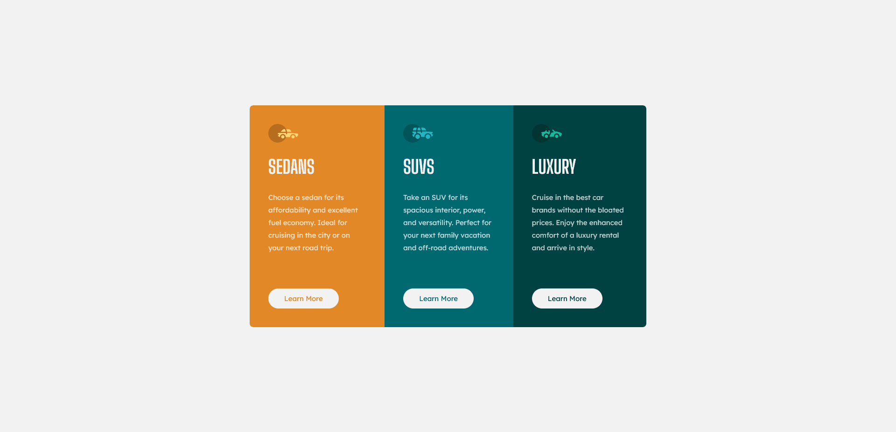
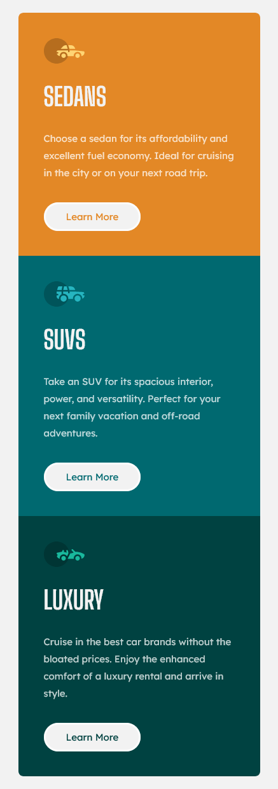

# Frontend Mentor - 3-Column Preview Card Component Solution

This is a solution to the [3-column preview card component challenge on Frontend Mentor](https://www.frontendmentor.io/challenges/3column-preview-card-component-pH92eAR2-).

## Table of contents

- [Overview](#overview)
  - [The challenge](#the-challenge)
  - [Screenshot](#screenshot)
  - [Links](#links)
- [My process](#my-process)
  - [Built with](#built-with)
  - [What I learned](#what-i-learned)
  - [Continued development](#continued-development)
  - [Useful resources](#useful-resources)
- [Author](#author)

## Overview

### The challenge

Users should be able to:

- View the optimal layout depending on their device's screen size.
- See hover states for interactive elements.

### Screenshot

### Links

- Solution URL: [GitHub](https://github.com/wesleyjacoby/3-Column-Preview-Card)
- Live Site URL: [GitHub Pages](https://your-live-site-url.com)

## My process

### Built with

- Semantic HTML5 markup
- CSS custom properties
- CSS Grid

### What I learned

This was the first time I was using CSS Grid. Although I'm still trying to get to grips with it, I do like how simple it is to make elements responsive using `grid-template-areas` and `grid-area`.

Another bit of use ful code that I learnt was `overflow: hidden`. This made the background colors easily conform to the border radius set on the container.

### Continued development

I would like to continue practicing CSS Grid, so that I'm comfortable using both it and Flexbox.

### Useful resources

- [The Free Tutorial Centre](https://resource-centre.net/css3-tutorials/turning-links-into-buttons/) - This helped me change my HTML slightly to make styling buttons with an anchor tag easier.

## Author

- Frontend Mentor - [@wesleyjacoby](https://www.frontendmentor.io/profile/wesleyjacoby)